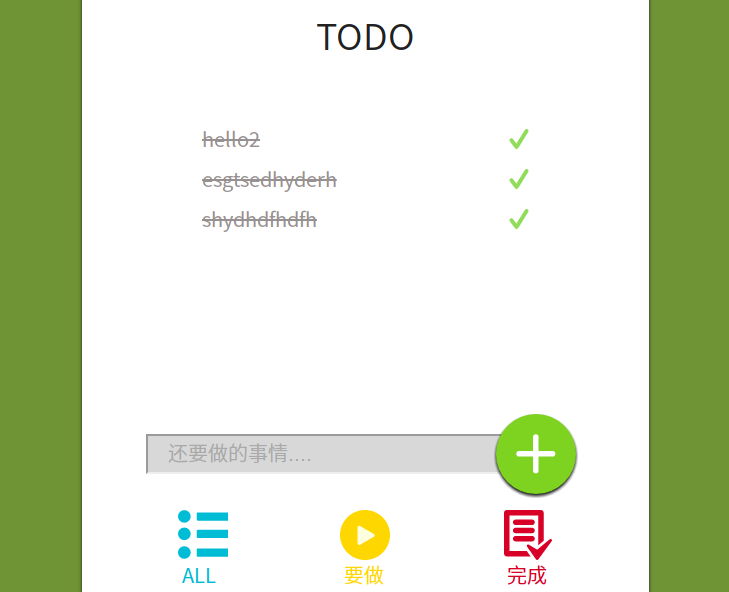

# TODO-redux

这是demo中的三个部分:

1.全部


2.未完成


3．已完成的




#### 说明：
```
前面有一个repository[todo-react]写过一个todo的demo，这个demo跟之前的实现的功能一样，不同点是这里使用了redux，(当然ui部分美的不像话 hh)较之前只使用react来说，redux真的是太方便了。

其实理解了redux修改数据的机制，掌握了核心，就会发现redux是多么的强大，使用起来真的很方便。

```
我个人认为它的核心其实就这几点:

**1.首先是一个状态树**

与我们之前react一样，将一切可变的部分全都用state 来控制。

**2.组件最顶层会用Provider包裹，传入store**

这样全部的组件(包括子组件)都可以拿得到状态树的所有内容。这点是最核心也是我们为什么用redux的原因

**3.修改state**

- 首先你要知道什么时候要修改state.

```
这个地方就是项目需求，什么时候变，该怎么变化。

一般都是页面的一个操作，使某些state变化。
```

- 弄清楚在哪里变化后，就要明白如何做才能触发这个变化。

```
react中我们会直接在事件中setState.

而在redux里，执行的操作只是发出一个action

然后底层reducer接收到以后，在它的函数中修改state
这里你可以在action中传入当前页面你想要的数据，reducer都可以接收到

修改时注意不要直接修改原来的state,而是拷贝后修改(参考之前笔记)
```
- 变化后，该如何传出去让组件使用

```
首先修改完state后，导出。这里需注意导出确保state还是对象。

导出后组件便可以通过store.getstate拿到

但是这个方法只是单一的取值，静态的，并不会引起页面的重新render.

因此我们使用connet ，将react与redux联系在一起，同时它会将state映射为props供组件使用。而我们知道在react中props的改变会造成重新render,这也就是我们使用connet的原因。(强大！！！)
```

剩余其他就是配合原生js,react,es6的知识了。尤其是数组，对象的一些方法(map filter)好用的不得了。

### 强推一个方法Object.keys()

当你原始数据为对象时，就会发现它有多么好用(返回key值的数组，可以map)

### 然后就是es7中的箭头函数了() =>

好用到无法自拔。格式简单，书写方便，看的舒服，高大上这些地球人都能看得见的优点就不说了。解决烦人的this指向问题；配合着babel这种神奇的语言，真的是想要什么就有什么。
